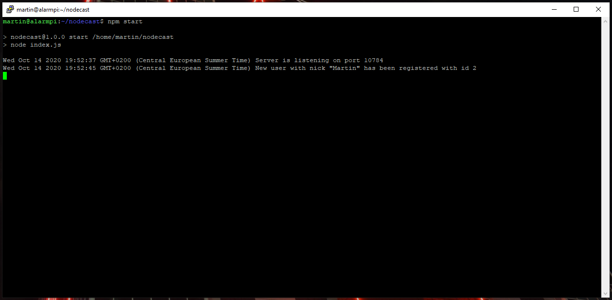

# NodeCast

NodeCast is NodeJS implementation of PartyCast server allowing it to be run on embedded devices.

In order to run project "as is" without modifications, you will need:
  1. Linux system
  2. 'omxplayer' package (debian: `sudo apt install omxplayer`, arch: `sudo pacman -S omxplayer`)
  3. nodejs(10+) and npm
  4. Create `music` folder and put your music there
  5. Run `npm start`
